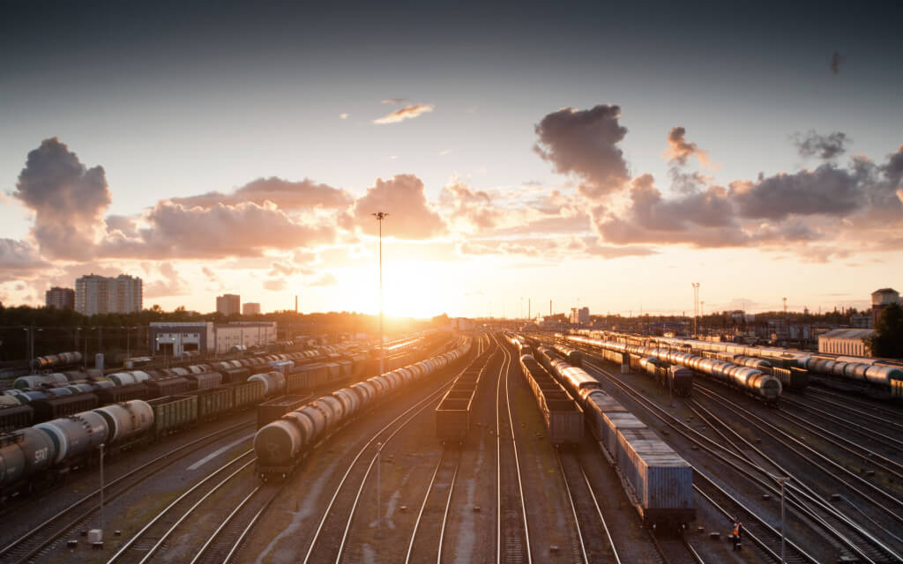

# Проект: Путешествие по России
https://sorokalex.github.io/russian-travel/

Проектаня работа посвещена прирлдным достопримечательностям России и путешествию  от столицы до Байкала на электричках.
 

Проект состоит из следующих блоков:

Шапка сайта:

1. header

Секции:

1. lead
2. intro
3. photo-grid
4. places + блок place
5. cover

Подавл сайта:

1. footer

При разработке сайта применялся подход **Mobile First** и **Адаптивная верстка**.
Для реализации адаптивности сайта под разные устройста применялись медиа запросы для следующих брейкпоинтов:

* 320px
* 544px
* 768px
* 1024px
* 1280px

